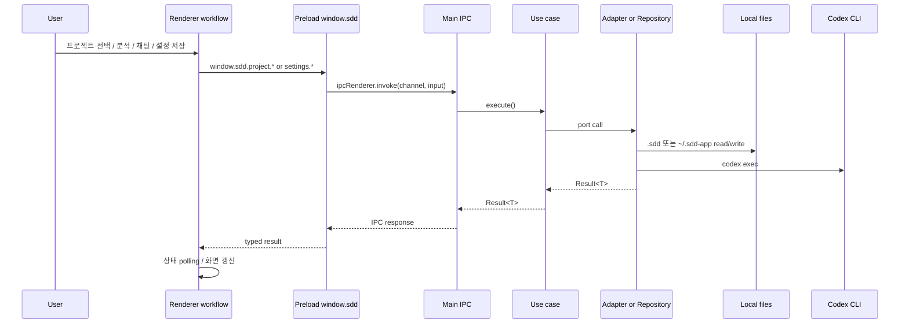

이 저장소의 주요 데이터 흐름은 거의 모두 `renderer -> preload -> main IPC -> use case -> adapter/repository` 형태다. 차이는 마지막 단계가 `.sdd` 파일 시스템인지, `~/.sdd-app/settings.json`인지, `codex exec`인지에 있다.

## 요청 경로

- renderer 쪽 진짜 조정자는 `src/renderer/features/project-bootstrap/project-bootstrap-page/use-project-bootstrap-workbench.workflow.ts`다. 프로젝트 활성화 후에는 analysis/specs/sessions를 병렬로 읽고, 분석 중에는 `readAnalysisRunStatus`를 1.5초 간격으로 polling한다.
- preload는 브리지일 뿐이라 비즈니스 로직이 없고, 모든 결과는 `Result<T>` 형태로 다시 renderer에 들어온다.

## 분석과 저장 흐름
- 프로젝트 열기: `project/activate`는 디렉터리를 inspect 하고, `.sdd`가 없지만 writable이면 바로 초기화하며, 최근 프로젝트 목록을 전역 설정에 반영한다.
- 전체 분석: `analyze-project-workflow.ts`가 저장 준비를 보장한 뒤 `node-project-analyzer.adapter.ts`에 위임한다. adapter는 먼저 로컬 정적 참조 추출을 수행하고, 설정이 준비돼 있으면 `node-project-analyzer-codex-execution.ts`를 통해 `codex exec` 보강 분석을 시도한다. 실패하면 로컬 결과로 fallback 한다.
- 저장: `fs-project-storage.repository.ts`는 기존 `analysis/`를 temp backup 한 뒤 `context.json`, `file-index.json`, `summary.md`, 개별 문서 markdown을 다시 쓰고, 기존 document layout과 reference tags를 보존한다.
- 참조 분석: mode가 `references`면 읽기 전용 프로젝트에서도 transient analysis를 반환할 수 있고, writable 프로젝트에서는 같은 storage 경로에 반영된다.

## 채팅과 설정 흐름
- 명세 채팅: `send-project-session-message.use-case.ts`는 먼저 user 메시지를 `.sdd/sessions/<id>/messages.jsonl`에 append 하고, 연결된 spec을 읽은 뒤 `node-project-spec-chat.adapter.ts`로 Codex 응답을 만든다. 성공하면 spec 새 버전을 저장하고 assistant 메시지도 다시 append 한다.
- reference tag 자동 생성: `node-project-reference-tag-generator.adapter.ts`는 현재 analysis file index를 valid path 집합으로 삼아 Codex 태그 결과를 검증하고, 저장은 다시 storage repository가 맡는다.
- 전역 설정: `use-agent-cli-settings-workflow.ts`와 workbench의 chat runtime 저장은 settings IPC를 통해 `fs-agent-cli-settings.repository.ts`로 들어가고, 최종적으로 `fs-app-settings-store.ts`가 `~/.sdd-app/settings.json`을 갱신한다. 기본 model, 추론 강도는 `~/.codex/config.toml`에서도 읽어 온다.
- CLI 연결 확인: `check-agent-cli-connection.use-case.ts`는 `node-agent-cli-runtime.adapter.ts`로 위임되고, runtime adapter는 `resolve-agent-cli-executable-path.ts`로 실행 파일을 찾은 뒤 `--version`을 실행해 상태를 만든다.