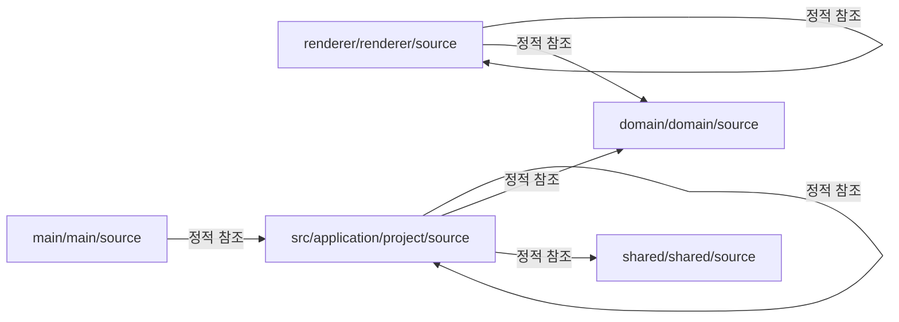

# 연결성과 데이터 흐름

이 문서는 레이어 간 정적 참조, 진입점 후보, 설정 파일을 한 화면에서 이어 보도록 정리한 흐름 문서입니다.

## 연결 다이어그램

## 핵심 연결

- renderer/renderer/source -> renderer/renderer/source: 정적 참조 95건. 예시: `src/renderer/App.tsx -> src/renderer/app-view.ts`.
- renderer/renderer/source -> domain/domain/source: 정적 참조 51건. 예시: `src/renderer/features/agent-cli-settings/agent-cli-settings.api.ts -> src/domain/app-settings/agent-cli-connection-model.ts`.
- src/application/project/source -> src/application/project/source: 정적 참조 48건. 예시: `src/application/project/activate-project.use-case.ts -> src/application/project/inspect-project.use-case.ts`.
- src/application/project/source -> domain/domain/source: 정적 참조 48건. 예시: `src/application/project/activate-project.use-case.ts -> src/domain/project/project-model.ts`.
- src/application/project/source -> shared/shared/source: 정적 참조 34건. 예시: `src/application/project/activate-project.use-case.ts -> src/shared/contracts/result.ts`.
- main/main/source -> src/application/project/source: 정적 참조 31건. 예시: `src/main/ipc/project-ipc-registration.ts -> src/application/project/activate-project.use-case.ts`.

## 진입점과 설정

- 진입점 후보: `out/main/main.js`, `src/main/main.ts`, `src/renderer/index.html`, `src/renderer/main.tsx`, `src/renderer/features/agent-cli-settings/index.ts`
- 설정 파일: `electron.vite.config.ts`, `eslint.config.mjs`, `package.json`, `tsconfig.json`

## 파일 인덱스 해석 팁

- 파일 인덱스 상위 항목은 참조가 집중된 파일부터 정렬되어 있습니다.
- 전체 파일 참조는 557건이며, 자세한 관계는 파일 인덱스와 참조 맵에서 확인할 수 있습니다.