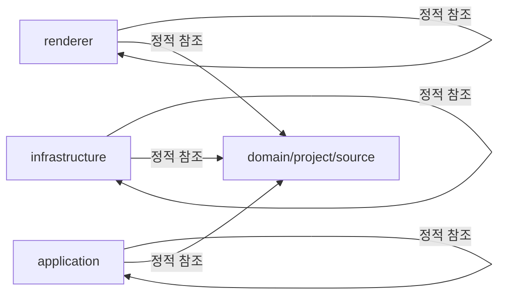

# 연결성과 데이터 흐름

이 문서는 레이어 간 정적 참조, 진입점 후보, 설정 파일을 한 화면에서 이어 보도록 정리한 흐름 문서입니다.

## 연결 다이어그램

## 핵심 연결

- renderer -> renderer: 정적 참조 87건. 예시: `src/renderer/App.tsx -> src/renderer/app-view.ts`.
- infrastructure -> infrastructure: 정적 참조 52건. 예시: `src/infrastructure/agent-cli/node-agent-cli-runtime.adapter.ts -> src/infrastructure/agent-cli/resolve-agent-cli-executable-path.ts`.
- infrastructure -> domain/project/source: 정적 참조 50건. 예시: `src/infrastructure/analysis/in-memory-project-analysis-run-status.store.ts -> src/domain/project/project-analysis-model.ts`.
- application -> application: 정적 참조 40건. 예시: `src/application/app-settings/check-agent-cli-connection.use-case.ts -> src/application/app-settings/app-settings.ports.ts`.
- renderer -> domain/project/source: 정적 참조 39건. 예시: `src/renderer/features/project-bootstrap/project-bootstrap-page/project-bootstrap-page.types.ts -> src/domain/project/project-analysis-model.ts`.
- application -> domain/project/source: 정적 참조 38건. 예시: `src/application/project/activate-project.use-case.ts -> src/domain/project/project-model.ts`.

## 진입점과 설정

- 진입점 후보: `out/main/main.js`, `src/main/main.ts`, `src/renderer/index.html`, `src/renderer/main.tsx`, `src/renderer/features/agent-cli-settings/index.ts`
- 설정 파일: `electron.vite.config.ts`, `eslint.config.mjs`, `package.json`, `tsconfig.json`

## 파일 인덱스 해석 팁

- 파일 인덱스 상위 항목은 참조가 집중된 파일부터 정렬되어 있습니다.
- 전체 파일 참조는 494건이며, 자세한 관계는 파일 인덱스와 참조 맵에서 확인할 수 있습니다.