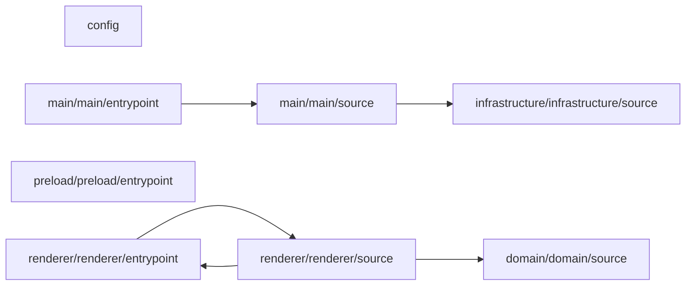

# 계층과 책임

주요 경로는 config, domain/domain/source, infrastructure/infrastructure/source, main/main/entrypoint, main/main/source, preload/preload/entrypoint, renderer/renderer/entrypoint, renderer/renderer/source, renderer/renderer/type, scripts/source, shared/shared/source, src/application/app-settings/source, src/application/project/source, src/infrastructure/agent-cli/source, src/infrastructure/analysis/source, src/infrastructure/app-settings/repository, src/infrastructure/app-settings/source, src/infrastructure/fs/source, src/infrastructure/reference-tags/source, src/infrastructure/sdd/repository, src/infrastructure/sdd/source, src/infrastructure/spec-chat/source, test 중심으로 나뉘어 있으며, 정적 참조 기준 연결 관계을 함께 저장합니다.

## 의존 방향

## 레이어별 책임

- config: 설정 관련 코드 4개.
- domain/domain/source: 도메인 domain 소스 관련 코드 7개. 의존: shared/shared/source.
- infrastructure/infrastructure/source: 인프라 infrastructure 소스 관련 코드 1개. 의존: shared/shared/source, src/application/project/source.
- main/main/entrypoint: 메인 main 진입점 관련 코드 1개. 의존: main/main/source, shared/shared/source.
- main/main/source: 메인 main 소스 관련 코드 5개. 의존: infrastructure/infrastructure/source, shared/shared/source, src/application/app-settings/source, src/application/project/source, src/infrastructure/agent-cli/source, src/infrastructure/analysis/source, src/infrastructure/app-settings/repository, src/infrastructure/fs/source, src/infrastructure/reference-tags/source, src/infrastructure/sdd/repository, src/infrastructure/spec-chat/source.
- preload/preload/entrypoint: preload preload 진입점 관련 코드 1개. 의존: shared/shared/source.
- renderer/renderer/entrypoint: 렌더러 renderer 진입점 관련 코드 5개. 의존: renderer/renderer/source.
- renderer/renderer/source: 렌더러 renderer 소스 관련 코드 57개. 의존: domain/domain/source, renderer/renderer/entrypoint, shared/shared/source.

## 경계에서 주의할 점

- renderer/renderer/source -> renderer/renderer/source: 정적 참조 114건. 예시: `src/renderer/App.tsx -> src/renderer/app-view.ts`.
- src/application/project/source -> src/application/project/source: 정적 참조 54건. 예시: `src/application/project/activate-project.use-case.ts -> src/application/project/inspect-project.use-case.ts`.
- renderer/renderer/source -> domain/domain/source: 정적 참조 53건. 예시: `src/renderer/features/agent-cli-settings/agent-cli-settings.api.ts -> src/domain/app-settings/agent-cli-connection-model.ts`.
- src/application/project/source -> domain/domain/source: 정적 참조 50건. 예시: `src/application/project/activate-project.use-case.ts -> src/domain/project/project-model.ts`.