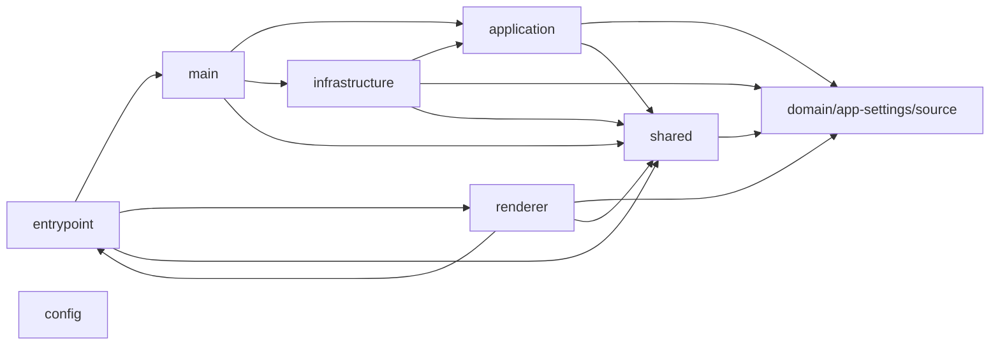

# 계층과 책임

주요 경로는 application, config, domain/app-settings/source, domain/project/source, entrypoint, infrastructure, main, renderer, scripts/source, shared 중심으로 나뉘어 있으며, 정적 참조 기준 연결 관계를 함께 저장합니다.

## 의존 방향

## 레이어별 책임

- entrypoint: 진입점 관련 코드 7개. 의존: main, renderer, shared.
- main: 메인 프로세스 관련 코드 5개. 대표 경로: `src/main`. 의존: application, infrastructure, shared.
- renderer: renderer UI 관련 코드 48개. 대표 경로: `src/renderer`. 의존: domain/app-settings/source, domain/project/source, entrypoint, shared.
- application: 애플리케이션 유스케이스 관련 코드 31개. 대표 경로: `src/application`. 의존: domain/app-settings/source, domain/project/source, shared.
- infrastructure: 인프라 연동 관련 코드 41개. 대표 경로: `src/infrastructure`. 의존: application, domain/app-settings/source, domain/project/source, shared.
- shared: 공용 계약 및 유틸리티 9개. 대표 경로: `src/shared`. 의존: domain/app-settings/source, domain/project/source.
- config: 설정 관련 코드 4개.
- domain/app-settings/source: 도메인 app-settings 소스 관련 코드 1개.

## 경계에서 주의할 점

- renderer -> renderer: 정적 참조 87건. 예시: `src/renderer/App.tsx -> src/renderer/app-view.ts`.
- infrastructure -> infrastructure: 정적 참조 52건. 예시: `src/infrastructure/agent-cli/node-agent-cli-runtime.adapter.ts -> src/infrastructure/agent-cli/resolve-agent-cli-executable-path.ts`.
- infrastructure -> domain/project/source: 정적 참조 50건. 예시: `src/infrastructure/analysis/in-memory-project-analysis-run-status.store.ts -> src/domain/project/project-analysis-model.ts`.
- application -> application: 정적 참조 40건. 예시: `src/application/app-settings/check-agent-cli-connection.use-case.ts -> src/application/app-settings/app-settings.ports.ts`.