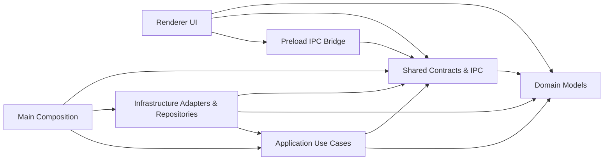

이 저장소의 런타임 구조는 Electron 프로세스 분리와 use case/port 패턴을 함께 쓰는 형태다. 핵심은 renderer에서 파일 시스템과 Codex 실행을 몰아내고, main이 use case와 adapter를 조립해 IPC 뒤로 숨기는 것이다.

## 의존 방향

- renderer는 `window.sdd`와 domain/shared 타입만 사용하고, `eslint.config.mjs`가 `@/infrastructure/*`, `@/main/*`, `electron`, `node:fs` 직접 import를 막는다.
- preload는 비즈니스 로직 없이 typed IPC facade만 만든다.
- main은 use case와 adapter를 동시에 아는 composition root다.
- application은 port 계약과 흐름 제어만 하고 concrete 구현을 모른다.
- infrastructure는 application port를 구현하면서 Node/Electron/fs/Codex에 접근한다.

## 레이어별 책임
- `Renderer UI`: `use-project-bootstrap-workbench.workflow.ts`와 `use-agent-cli-settings-workflow.ts`가 화면 상태, progress card, 선택 컨텍스트를 묶는다.
- `Preload IPC Bridge`: `src/preload/index.ts`가 `createRendererProjectApi`, `createRendererSettingsApi`를 `window.sdd`로 노출한다.
- `Main Composition`: `register-project-ipc.ts`, `register-settings-ipc.ts`가 저장소, 분석기, CLI runtime, use case 조립을 끝낸다.
- `Application Use Cases`: `analyze-project-workflow.ts`, `send-project-session-message.use-case.ts`, `ensure-project-storage-ready.ts`가 저장 준비, 분석, spec update, 세션 append를 orchestration 한다.
- `Domain Models`: schemaVersion, revision, latestVersion, run status, default model 같은 규칙을 domain에 고정한다.
- `Infrastructure Adapters & Repositories`: `.sdd` 저장, 전역 설정 저장, Codex 실행, 실행 파일 탐색, Electron dialog, 정적 스캔을 실제 구현한다.
- `Shared Contracts & IPC`: project/settings channel 이름과 payload 타입을 양쪽 프로세스가 같이 본다.

## 경계 메모
- `shared/ipc`는 완전히 독립적인 lowest-level shared라기보다, domain 타입을 재사용하는 프로세스 간 계약층에 가깝다. IPC 계약 변경은 domain, preload, renderer에 동시에 파급된다.
- 분석 진행 상태는 별도 저장이 아니라 main process 메모리 store에만 존재하고, renderer polling이 그것을 읽는다.
- `src/infrastructure/sdd/fs-project-storage.repository.ts`는 storage layer이면서 revision conflict, backup/restore, 문서 layout 보존까지 담당하므로 현재 구조에서 가장 무거운 infrastructure 모듈이다.