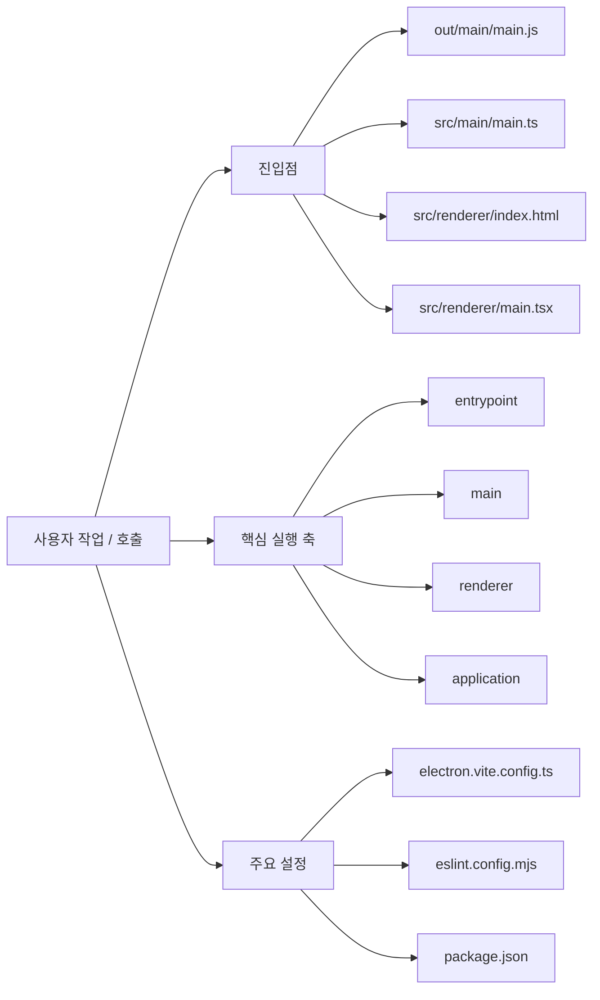

`sdd`는 개발자가 자기 노트북에서 로컬 프로젝트를 열고, 구조 분석 결과와 명세 문서를 축적한 뒤, 명세에 연결된 채팅으로 초안을 갱신하도록 만든 로컬 앱이다. 저장소 차원에서는 이 제품 목적을 구현 코드와 설계 문서, 프로젝트 전용 skill 세트로 동시에 관리한다.

## 누구를 위한가
- 사용자는 팀 서버가 아니라 자기 로컬 프로젝트를 다루는 단일 개발자다.
- 작업 시작점은 프로젝트 폴더 선택이다. 이후 앱은 읽기/쓰기 가능 여부를 확인하고, 쓰기 가능하면 대상 프로젝트 내부에 `.sdd/`를 초기화한다.
- 중앙 작업영역은 `분석`, `명세`, `참조` 세 페이지로 나뉘고, 오른쪽 패널은 항상 `채팅` 역할을 맡는다.

## 현재 코드가 실제로 제공하는 기능
- 프로젝트 활성화: 디렉터리 선택, 읽기/쓰기 상태 검사, `.sdd` 초기화, 최근 프로젝트 목록 저장/정렬/이름 변경/제거.
- 분석: 전체 분석과 참조 분석을 분리해 실행하고, renderer는 in-memory run status를 polling하며 결과를 `analysis/*.md`, `context.json`, `file-index.json`으로 읽어 온다. 읽기 전용 프로젝트는 참조 분석을 저장 없이 화면에만 임시 표시할 수 있다.
- 명세: 새 명세 생성, Markdown 본문 저장, 버전 증가, `specs/index.json` 재생성.
- 채팅: 명세와 연결된 세션을 자동 생성하고, `messages.jsonl`에 user/assistant 메시지를 append 하며, Codex 응답으로 spec 초안을 함께 갱신한다.
- 설정: Codex CLI 실행 경로, 인증 방식, 모델, 추론 강도를 저장하고 실제 CLI 실행 가능 여부를 확인한다.
- 참조 태그: 현재 분석 file index를 바탕으로 태그를 직접 저장하거나 Codex로 자동 생성하고, 취소도 가능하다.

## 운영 제약
- 백엔드 서버와 DB는 없다. 프로젝트 데이터는 대상 저장소의 `.sdd/`에, 전역 설정은 `~/.sdd-app/settings.json`에 저장된다.
- 분석, 명세 채팅, 참조 태그 생성에서 실제 LLM 호출은 모두 `codex exec` 기반이다. `app-server`, `mcp-server`는 문서와 모델 정의에는 보이지만 현재 런타임 경로는 아니다.
- 프로젝트 경로가 읽기 전용이면 전체 분석 저장, 명세 저장, 채팅 저장은 막히고, 참조 분석만 저장 없이 허용된다.
- 문서와 skill이 풍부하게 들어 있지만, 현재 실행 코드 범위는 아직 제품 문서 전체 로드맵을 다 구현하지는 않았다.

## 정적 분석 시각 요약

