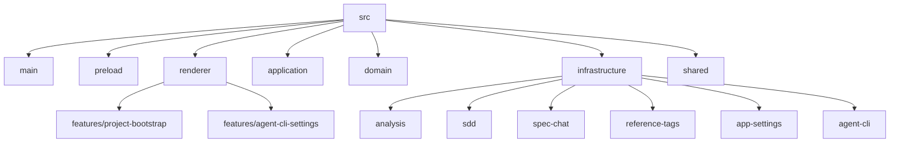

저장소는 단일 Electron 앱에 가깝지만, 실행 코드만 있는 형태는 아니다. `src/` 아래에 앱 본체가 있고, `docs/codex-spec-workflow/`와 `.codex/skills/`가 설계 계약을, `scripts/`가 개발·패키징 파이프라인을, `.sdd/`가 생성 산출물을 맡는다.

## 루트 분할
- `src/`: 실제 앱 코드. main/preload/renderer와 application/domain/infrastructure/shared를 함께 둔다.
- `docs/codex-spec-workflow/`: 제품 목적, 아키텍처, 저장 포맷, Codex CLI 연결 전략을 나눈 설계 문서 묶음.
- `.codex/skills/`: 저장소 전용 Codex skill. 구현 가드레일, MVP 범위, 저장 포맷, UI 문구, XML prompt 규약을 분리한다.
- `scripts/`: `scripts/run-dev.ts`, `scripts/prepare-dev-mac-app.ts`, `scripts/generate-icon-assets.ts` 중심의 개발/배포 보조 스크립트.
- `.sdd/`: 이 저장소 자체를 분석한 산출물. 앱이 다루는 저장 형식을 dogfood 형태로 보여준다.

## `src/` 실행체

- `src/main`: `src/main/main.ts`가 앱 부트스트랩, `src/main/ipc/register-*.ts`가 composition root다.
- `src/preload`: `src/preload/index.ts` 하나가 `window.sdd` bridge를 노출한다.
- `src/renderer`: 루트 shell은 얇고, 실제 복잡도는 `project-bootstrap` feature의 workflow와 map/document/chat UI에 집중된다.
- `src/application`: use case와 port 계약만 둔다.
- `src/domain`: project/spec/session/analysis/reference-tag/app-settings schema를 묶는다.
- `src/infrastructure`: `.sdd` 저장소, 분석기, Codex 실행, 글로벌 설정 저장을 concrete implementation으로 제공한다.
- `src/shared`: Result/AppError와 IPC 채널/renderer helper를 둔다.

## 구조상 메모
- renderer 복잡도는 `src/renderer/features/project-bootstrap/project-bootstrap-page/` 아래에 집중돼 있다. page 조립, workflow hook, view-model, map/document component가 세분화돼 있다.
- `src/infrastructure/sdd/`는 단순 파일 I/O helper가 아니라, 분석 문서, 명세, 세션, versioning, revision conflict, backup 복구까지 맡는 저장소 계층이다.
- `src/main 2`, `src/preload 2`, `src/renderer 2`는 현재 빌드에서 제외된다. 특히 `src/renderer 2`는 과거 단순 버전처럼 보여 현재 구조와 별도 취급하는 편이 맞다.