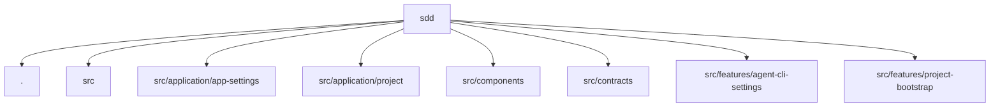

# 구조와 주요 모듈

sdd의 구조는 경로 중심으로 책임이 나뉘어 있습니다. 이 문서는 디렉터리 단위의 분할 방식과 상위에서 먼저 읽어야 할 파일을 함께 보여줍니다.

## 구조 다이어그램

## 핵심 디렉터리

- `.`: 주요 파일 186개. 소스 166개, 진입점 7개, 설정 파일 4개 중심 경로입니다. (main)
- `src`: 주요 파일 175개. 소스 163개, 진입점 7개, 레포지토리 4개 중심 경로입니다. (main)
- `src/application/app-settings`: 주요 파일 4개. 소스 4개 중심 경로입니다. (application)
- `src/application/project`: 주요 파일 38개. 소스 38개 중심 경로입니다. (application)
- `src/components`: 정적 분석에서 주요 디렉터리로 감지했습니다.
- `src/contracts`: 정적 분석에서 주요 디렉터리로 감지했습니다.

## 대표 파일

- `src/main/ipc/project-ipc-registration.ts`: 메인 소스. 메인 소스입니다. TypeScript 파일 기준으로 나가는 참조 44건, 들어오는 참조 1건.
- `src/infrastructure/sdd/fs-project-storage.repository.ts`: 인프라 레포지토리. 인프라 레포지토리입니다. TypeScript 파일 기준으로 나가는 참조 15건, 들어오는 참조 2건.
- `src/renderer/features/project-bootstrap/project-bootstrap-page/use-project-bootstrap-workbench.workflow.ts`: 렌더러 소스. 렌더러 소스입니다. TypeScript 파일 기준으로 나가는 참조 12건, 들어오는 참조 1건.
- `src/infrastructure/analysis/node-project-analyzer.adapter.ts`: 인프라 소스. 인프라 소스입니다. TypeScript 파일 기준으로 나가는 참조 10건, 들어오는 참조 1건.
- `src/infrastructure/analysis/project-analysis-local-reference-extractor.ts`: 인프라 소스. 인프라 소스입니다. TypeScript 파일 기준으로 나가는 참조 10건, 들어오는 참조 1건.
- `src/renderer/features/project-bootstrap/project-bootstrap-page/ProjectBootstrapPage.tsx`: 렌더러 소스. 렌더러 소스입니다. TypeScript 파일 기준으로 나가는 참조 10건, 들어오는 참조 1건.

## 구조 해석 포인트

- 주요 경로는 config, domain/domain/source, infrastructure/infrastructure/source, main/main/entrypoint, main/main/source, preload/preload/entrypoint, renderer/renderer/entrypoint, renderer/renderer/source, renderer/renderer/type, scripts/source, shared/shared/source, src/application/app-settings/source, src/application/project/source, src/infrastructure/agent-cli/source, src/infrastructure/analysis/source, src/infrastructure/app-settings/repository, src/infrastructure/app-settings/source, src/infrastructure/fs/source, src/infrastructure/reference-tags/source, src/infrastructure/sdd/repository, src/infrastructure/sdd/source, src/infrastructure/spec-chat/source, test 중심으로 나뉘어 있으며, 정적 참조 기준 연결 관계을 함께 저장합니다.
- 우선순위 경로: `.`, `src`, `src/application/app-settings`, `src/application/project`