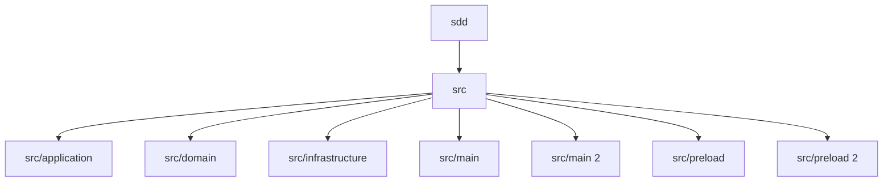

# 구조와 주요 모듈

sdd의 구조는 경로 중심으로 책임이 나뉘어 있습니다. 이 문서는 디렉터리 단위의 분할 방식과 상위에서 먼저 읽어야 할 파일을 함께 보여줍니다.

## 구조 다이어그램

## 핵심 디렉터리

- `src`: 주요 파일 148개. 소스 136개, 진입점 7개, 레포지토리 4개 중심 경로입니다. (src/source)
- `src/application`: 주요 파일 31개. 소스 31개 중심 경로입니다. (application)
- `src/domain`: 주요 파일 7개. 소스 7개 중심 경로입니다. (domain/source)
- `src/infrastructure`: 주요 파일 41개. 소스 37개, 레포지토리 4개 중심 경로입니다. (infrastructure)
- `src/main`: 주요 파일 6개. 소스 5개, 진입점 1개 중심 경로입니다. (main)
- `src/main 2`: 정적 분석에서 주요 디렉터리로 감지했습니다. (main 2/source)

## 대표 파일

- `src/main/ipc/project-ipc-registration.ts`: 메인 소스. 메인 소스입니다. TypeScript 파일 기준으로 나가는 참조 35건, 들어오는 참조 1건.
- `src/infrastructure/sdd/fs-project-storage.repository.ts`: 인프라 레포지토리. 인프라 레포지토리입니다. TypeScript 파일 기준으로 나가는 참조 14건, 들어오는 참조 1건.
- `src/renderer/features/project-bootstrap/project-bootstrap-page/use-project-bootstrap-workbench.workflow.ts`: 렌더러 소스. 렌더러 소스입니다. TypeScript 파일 기준으로 나가는 참조 12건, 들어오는 참조 1건.
- `src/infrastructure/analysis/node-project-analyzer.adapter.ts`: 인프라 소스. 인프라 소스입니다. TypeScript 파일 기준으로 나가는 참조 10건, 들어오는 참조 1건.
- `src/renderer/features/project-bootstrap/project-bootstrap-page/ProjectBootstrapPage.tsx`: 렌더러 소스. 렌더러 소스입니다. TypeScript 파일 기준으로 나가는 참조 10건, 들어오는 참조 1건.
- `src/infrastructure/sdd/fs-project-storage-documents.ts`: 인프라 소스. 인프라 소스입니다. TypeScript 파일 기준으로 나가는 참조 9건, 들어오는 참조 2건.

## 구조 해석 포인트

- 주요 경로는 application, config, domain/app-settings/source, domain/project/source, entrypoint, infrastructure, main, renderer, scripts/source, shared 중심으로 나뉘어 있으며, 정적 참조 기준 연결 관계를 함께 저장합니다.
- 우선순위 경로: `src`, `src/application`, `src/domain`, `src/infrastructure`