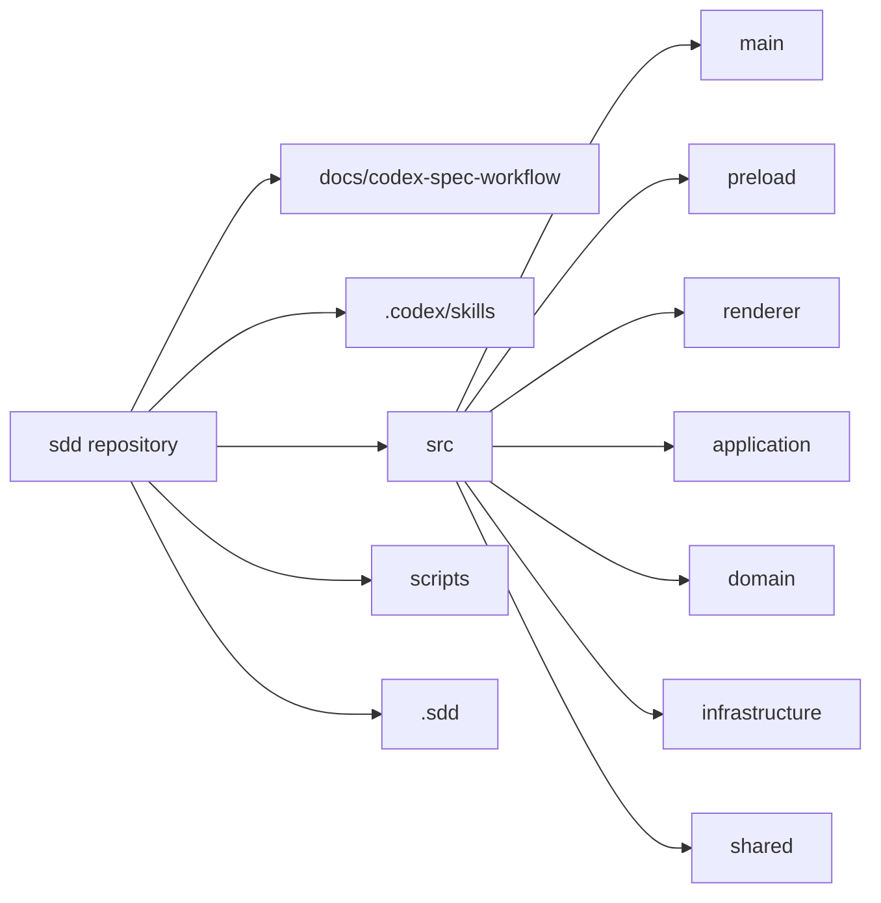

`sdd` 저장소는 로컬 개발자용 Electron 앱 구현과, 그 앱이 따르는 설계 문서·프로젝트 전용 Codex skill을 함께 보관한다. 실제 런타임 경로는 `src/` 아래에 집중돼 있고, 루트의 `docs/`, `.codex/skills/`, `scripts/`, `.sdd/`는 각각 설계 기준, 에이전트 지식, 개발 툴링, 생성 산출물을 맡는다.

## 감지 스택
- `Electron`, `React`, `TypeScript`, `Node.js`, `Vite`, `npm`, `Codex CLI`
- 주요 진입점은 `scripts/run-dev.ts`, `src/main/main.ts`, `src/preload/index.ts`, `src/renderer/main.tsx`다.
- 주요 설정은 `package.json`, `tsconfig.json`, `electron.vite.config.ts`, `eslint.config.mjs`, `.prettierrc.json`, `.nvmrc`에 모여 있다.

## 빠른 방향 감각

## 현재 읽어야 할 축
- 제품 기능의 중심은 `src/renderer/features/project-bootstrap`이다. 중앙 `analysis/specs/references` 작업영역과 오른쪽 `채팅` 패널을 한 workflow에서 묶는다.
- 런타임 경계의 핵심은 `src/main/ipc/register-project-ipc.ts`, `src/main/ipc/register-settings-ipc.ts`, `src/preload/index.ts`다. 여기서 IPC 채널과 concrete adapter wiring이 끝난다.
- 저장/분석/Codex 연동의 실체는 `src/infrastructure/analysis`, `src/infrastructure/sdd`, `src/infrastructure/spec-chat`, `src/infrastructure/reference-tags`, `src/infrastructure/app-settings`에 있다.
- 이 저장소는 앱 코드만 있는 것이 아니라 `docs/codex-spec-workflow/`와 `.codex/skills/`로 설계 계약까지 같이 버전 관리한다.

## 확인 필요
- `src/main 2`, `src/preload 2`, `src/renderer 2`는 현재 빌드에서 제외된 복제본이다. 정리 대상처럼 보이지만 유지 이유는 코드만으로 확정되지 않는다.
- 문서에는 patch/diff/execution preparation까지 적혀 있지만, 현재 연결된 실행 코드는 분석, 참조 태그, 명세/채팅, 설정 범위까지다.
- `runs/` 디렉터리는 생성되지만, 검토한 코드에서는 아직 적극적으로 사용하지 않는다.
- 테스트 전략 문서는 존재하지만 실제 테스트 설정과 테스트 파일은 보이지 않는다.